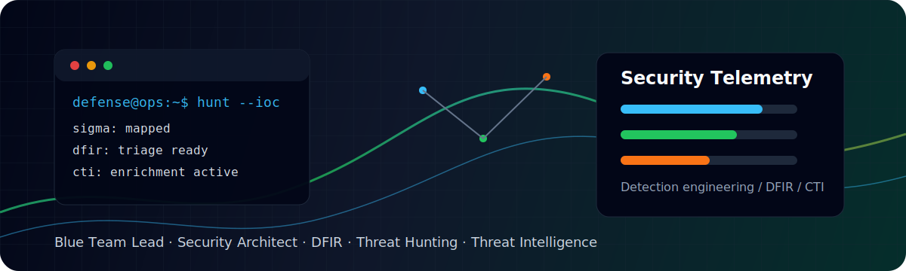

  

  <h1>Wahid Hendrawan</h1>
  <h3>Blue Team Lead · Security Architect · DFIR · Threat Hunting · Threat Intelligence</h3>

  

    I build practical security operations capabilities: detection engineering, incident response,
    threat hunting, intelligence workflows, DFIR tooling, and low-cost security architecture for teams
    that need security outcomes they can deploy, inspect, and maintain.
  

  

    
    
    
  

---

## 👋 Operator Snapshot

| Area | Current Focus |
|---|---|
| 🛡️ Security Operations | SOC engineering, alert triage, case workflow, response playbooks |
| 🎯 Detection Engineering | Sigma, SIEM/XDR content, MITRE ATT&CK mapping, multi-platform rules |
| 🕵️ Threat Hunting | IOC/IOA hypothesis building, telemetry pivoting, adversary behavior tracking |
| 🧪 DFIR | Log analysis, forensic triage, incident reconstruction, investigation tooling |
| 🛰️ Threat Intelligence | IOC enrichment, CVE prioritization, OSINT collection, operational reporting |
| 🏗️ Security Architecture | Low-cost security architecture, platform integration, defense capability roadmaps |
| ⚙️ Automation | Python, JavaScript, Docker, API integration, SOAR workflow automation |

---

## 🚀 Mission Board

<table>
  <tr>
    <td width="50%" valign="top">
      <h3>🧭 Detection-Rules</h3>
      
Cross-platform detection library for Sigma, Elastic, Splunk, Sentinel, Wazuh, Carbon Black, CrowdStrike, SentinelOne, and Falco.

      

        
        
      

    </td>
    <td width="50%" valign="top">
      <h3>🔁 YARA to Sigma WebUI</h3>
      
Converter for turning YARA rules into Sigma rules and native SIEM/EDR queries with CLI, web UI, Docker support, and tested conversion paths.

      

        
        
      

    </td>
  </tr>
  <tr>
    <td width="50%" valign="top">
      <h3>🛰️ ThreatDock</h3>
      
Threat intelligence and security operations dashboard for advisories, CVEs, IOCs, alert context, and case workflows.

      

        
        
      

    </td>
    <td width="50%" valign="top">
      <h3>🔎 Forensis</h3>
      
Threat analysis and digital forensics platform with log and network analyzers, memory triage, Sigma correlation, and MFA-enabled administration.

      

        
        
      

    </td>
  </tr>
</table>

---

## 🧰 Arsenal

> My hobby is learning new things. These are security, infrastructure, intelligence, automation, and observability tools I have used or recently studied.

### 🛡️ Network, Endpoint, and Security Platforms

### 🎯 SIEM, Detection, SOAR, and Case Management

### 🛰️ Threat Intelligence, Adversary Emulation, and Forensics

### ☁️ Cloud, DevOps, Automation, and Observability

---

## 🔓 Unlocking New Experience

- System Engineer / Cyber Security Architect
- Digital Forensics on Corporate
- Trainer Cyber Security on BUMN
- Automation Engineer
- Head of Cyber Security Team

---

## 📌 Current Direction

- Learning new security and infrastructure tooling continuously.
- Designing low-cost IT security architecture that is practical to operate.
- Publishing reusable detection engineering and threat hunting content.
- Improving practical SOC, DFIR, and CTI tooling for small and medium security teams.
- Sharing knowledge for the advancement of Indonesian cybersecurity education.

---

## 🐍 Contribution Game

  

---

## 🤝 Connect

  
  

